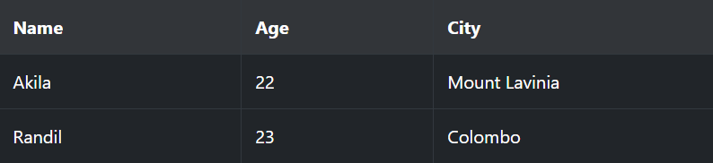

# &lt;HTON&gt; - Hyper Text Object Notation

HTON is a data structure specifically designed to reconstruct an HTML string. A Javascript and a PHP library is provided to make use the data structure which will cause to increase development productivity and better communication efficiency.

Because the library automatically constructs the HTML string using HTON, there is very little workload in the client-end since it eliminates the extraction and data manipulation that is to be done in order to create an HTML string.

1. Assume that the expected output is the following table.

  

2. The server side code would be the following (PHP).
```
      $element = new HTMLElement(
          "table",
          array(
              new HTMLElement("tr",
                  array(
                      new HTMLElement("th", "Name"),
                      new HTMLElement("th", "Age"),
                      new HTMLElement("th", "City")
                  )),
              new HTMLElement("tr",
                  array(
                      new HTMLElement("td", "Akila"),
                      new HTMLElement("td", "22"),
                      new HTMLElement("td", "Mount Lavinia")
                  )),
              new HTMLElement("tr",
                  array(
                      new HTMLElement("td", "Randil"),
                      new HTMLElement("td", "23"),
                      new HTMLElement("td", "Colombo")
                  ))
          ),
          array(
              new HTMLAttribute("id", "personTable"),
              new HTMLAttribute("class", "table table-hover table-dark table-bordered")));
      $encoder = new HTON();
      $code = $encoder->convertToHTMLEncoder($element);
```

3. The client side code will only be limited to one single line.

```
	    HTON.convertToHTML(result);
```

4. And you will have the full HTML string.

5. The HTON data structure for the above result is as the following

```
    <table id=personTable class="table table-hover table-dark table-bordered":[
          <tr:[
                <th:Name>,
                <th:Age>,
                <th:City>
              ]
          >,
          <tr:[
                <td:Akila>,
                <td:22>,
                <td:Mount Lavinia>
              ]
          >,
          <tr:[
                <td:Randil>,
                <td:23>,
                <td:Colombo>
              ]
          >
       ]
    >
```

# HTON Data Structure 

There are few simple rules that is crucial for the construction of an HTON data structure

1. An object starts with **<** and ends with **>**
2. An array starts with **[** and ends with **]**
3. All keys and values WILL be considered as strings. Hence enclosing with double quotations is not needed unless a value contains the following characters
    * **<**
    * **>**
    * **[**
    * **]**
    * **:**
 4. The value of an attribute MUST be enclosed with double quotations only if the value contains whitespaces

# JavaScript Library

 The user may use the following methods to get the HTML string from an HTON data format value
 
      HTON.convertToHTML(data)
 
      HTON.decode(data) -- Use this only if the data is already processed to an object/array with proper values and structuring
 
  If the use desires to append the data to the DOM, use
 
      HTON.appendToDOM(elementId, HTMLString)
 
  If the user desires to decode the HTON data and append the resulted HTML string directly, use
 
      HTON.convertAndAppendToDOM(elementID,data)
 
  If the user desires to have only the JavaScript Object/Array, use,
 
      HTON.deSerialize(data)
 
  If the user desires to have a JSON structure converted from the HTON data type, use
 
      HTON.convertToJSONString(HTMLEncoderData)
 
 # PHP Library
 
 The use may use HTMLElement Object to create an element. It accepts two mandatory parameters and an optional parameter.
 
 1. The name of the element (Must be a string)
 2. The value of the element (Can be another HTMLElement or an array of HTMLElement objects or a string)
 3. Attributes of the element (Can be an HTMLAttribute object or an array of HTMLAttribute objects)
 
 ```
      $element = new HTMLElement("element","value",new HTMLAttribute("attributeName","value"));
 ```
 The user may use HTMLAttribute object to create an attribute for an element. It accepts two mandatory parameters.
 1. The name of the attribute (Must be a string)
 2. The value of the attribute (Must be a string)
 

 ```
      $attribute = new HTMLAttribute("attributeName","value");
 ```
 
 To encode data to HTON, use HTON object as following.
 
 ```
      $encoder = new HTON();
      $hton = $encoder->convertToHTMLEncoder($element);
 ```
 If you want to convert this to an array and get the encoded HTON structure, do th following
 
 ```
      $array = $element->toArray();
      $encoder = new HTON();
      $code = $encoder->convertToHTMLEncoder($array);
 ```
 If you want to access and modify values before encoding, do the following
 
 * Use the **val** keyword to access the value of the element.
 
 ```
      $array["table"]["val"]= $newElement->toArray();
 ```
 
 
## Important!

* Update the config.ini file. Make sure the proper data is added to the necessary property. 
  Eg: userName = "Your user name"

 * The SQL file is included within this project as SqlData.sql. Use that to create the necessary table. 
 * Run the project in an Apache server to use the Prototype and the Benchmark Tool
