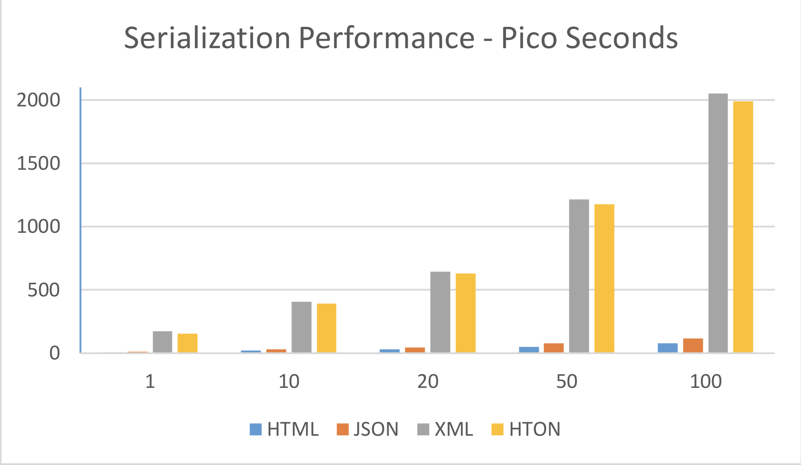
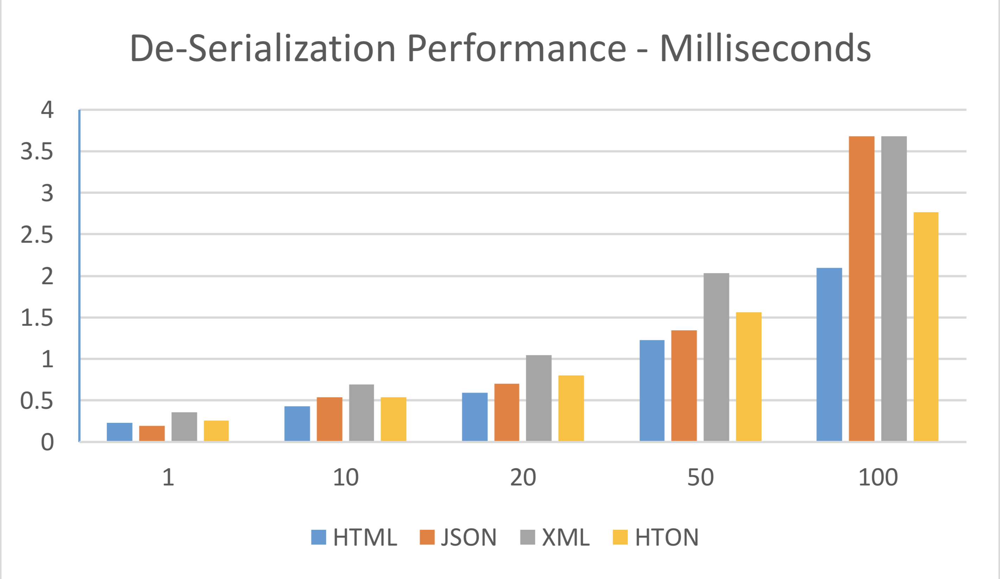
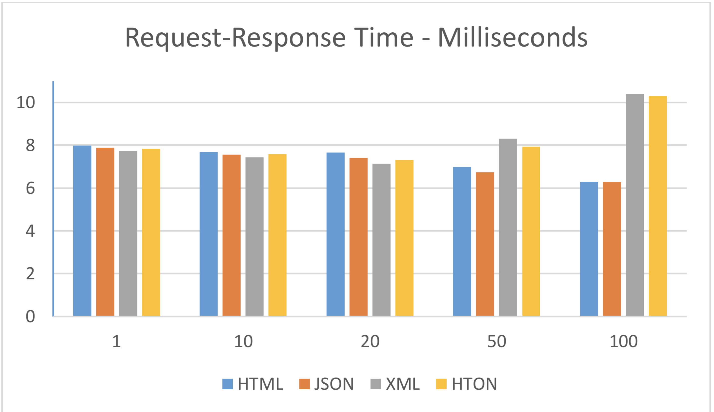
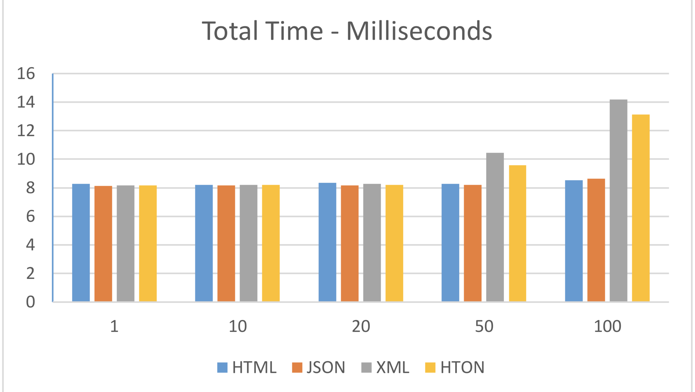
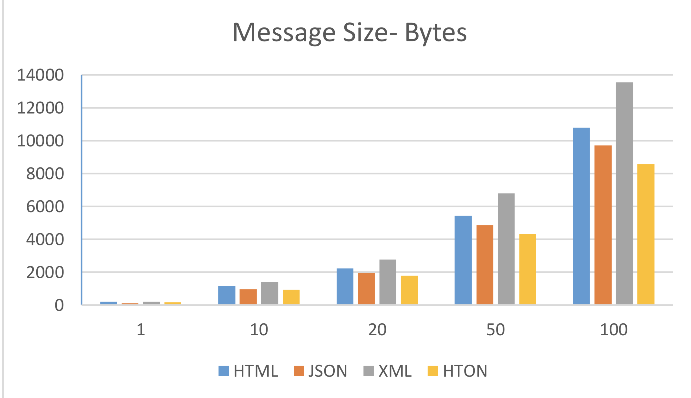

# Performance Testing

HTON was benchmarked against HTML, XML and JSON. 

The testing were done under the following system variables

Environmental Variables –

• Machine – MacBook Pro (15-inch, 2017)

• OS – macOS High Sierra 10.13.3

• Storage – 256 Flash Storage

• Memory – 16 GB

• Browser – Safari Version 11.0.3 (13604.5.6)

Remote Server –

• OS – Linux

• Storage – 500 MB

• PHP Version – 7.0

• Internet (At the time of the test)

Connection – Fiber

• Download Bandwidth – 55 Mbps

• Upload Bandwidth – 45.3 Mbps

The testing were done for 5 aspects.

1. Serialization Time 
2. De-Serialization Time 
3. Request-Response Time 
4. Total Time
5. Message Size

## Serialization Time

## De-Serialization Time

## Request-Response Time

## Total Time

## Message Size

